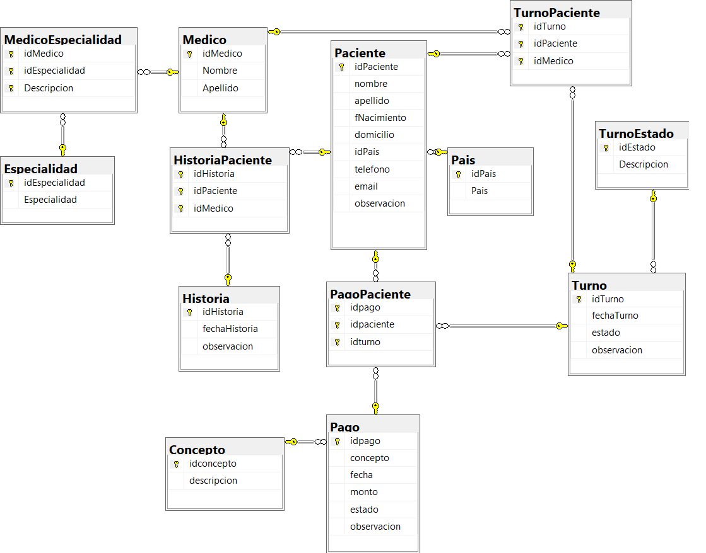

# Base de Datos para un Centro Médico
Repositorio para el Proyecto de un Centro Médico del Curso de Certificación de SQL SERVER de IBM SkillsBuild, DataHack y Fundae
# 1. Diseñando la base de datos

